# Robomaster-PCBs

This is the PCBs Chen Qian Created for ZJUI-UIUC Robomaster Team. It contains PCBs for vehicle coded "Hero" (Launch 42mm golf ball) and vehicle coded "infantry", which launches 17mm rubber bullet.

# Hero PCB v1.0

PCB installed on gimbal adopted a rotatable design, simplified the maintaining process. As the slip ring were applied on vehicles, an 12-pin connector connects the PCB installed on chassis to the PCB installed on gimbal.

    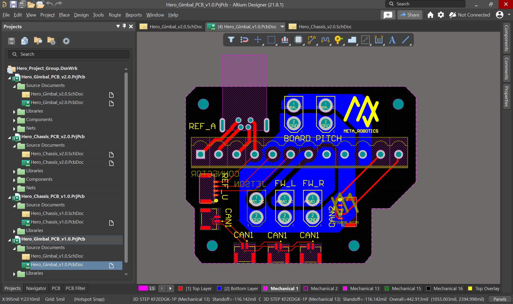
    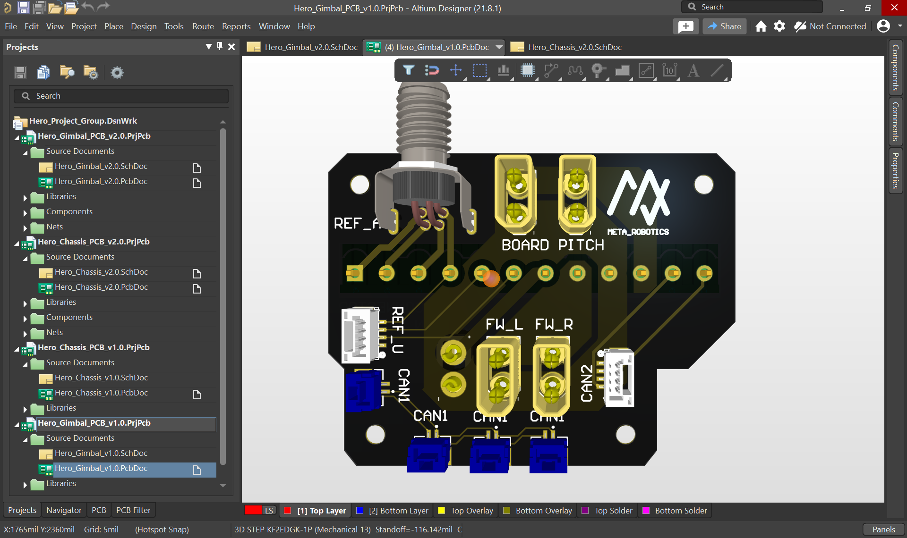
    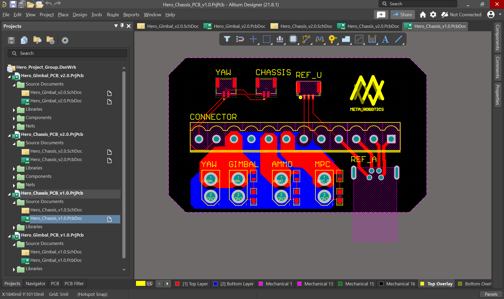
    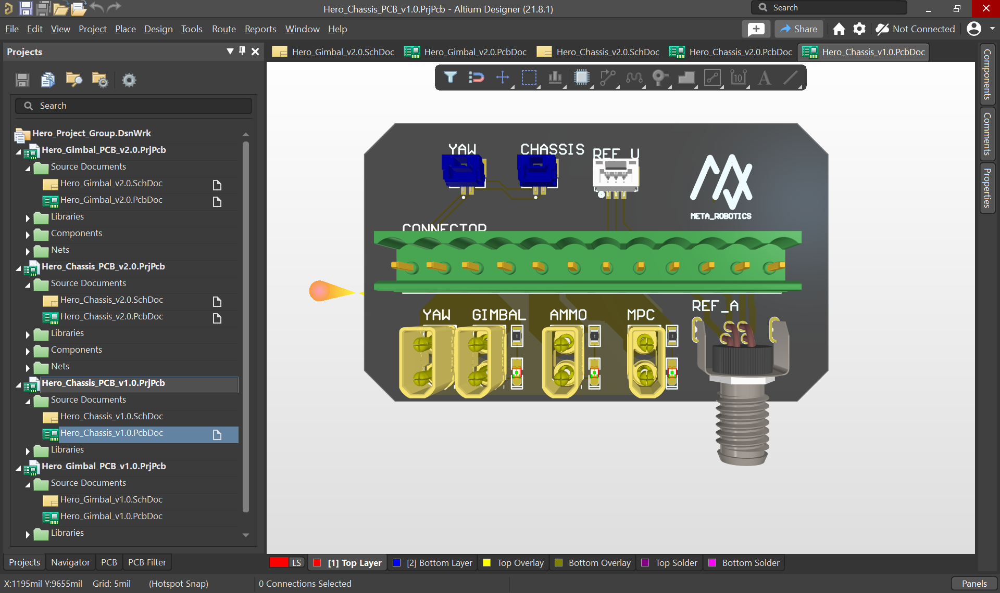

# Hero PCB v2.0

With the development of next generation robot, PCBs were also modified. For simplicity, LEDs on chassis PCB were removed. The connectors were changed to horizontal so it took less space.
    
    
    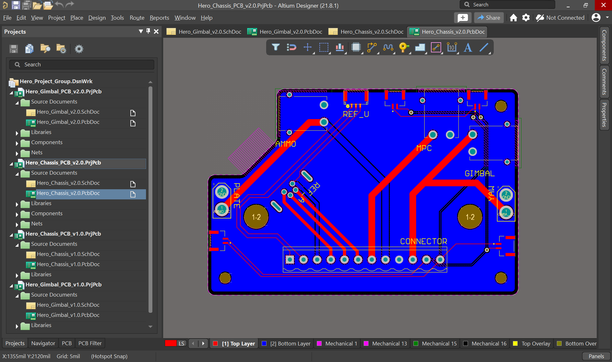
    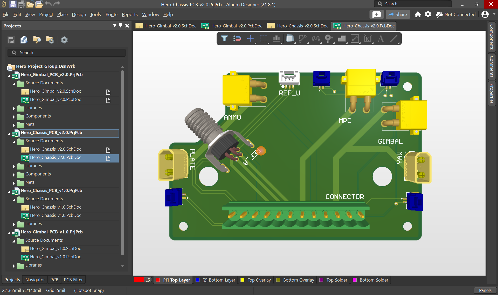

# Standard PCB v1.0

This is the PCBs for vehicle coded "Infantry". In the first generation, there were 4 layers in the PCB for better reliability.

    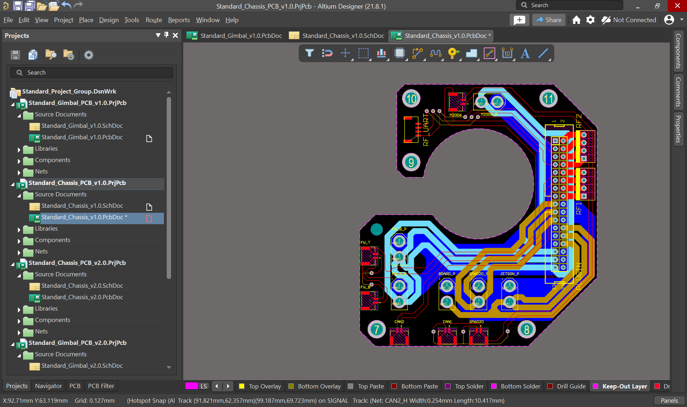
    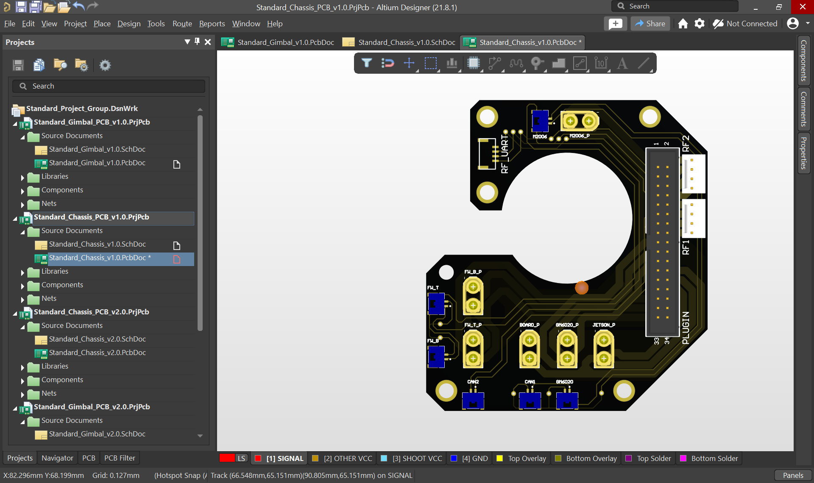
    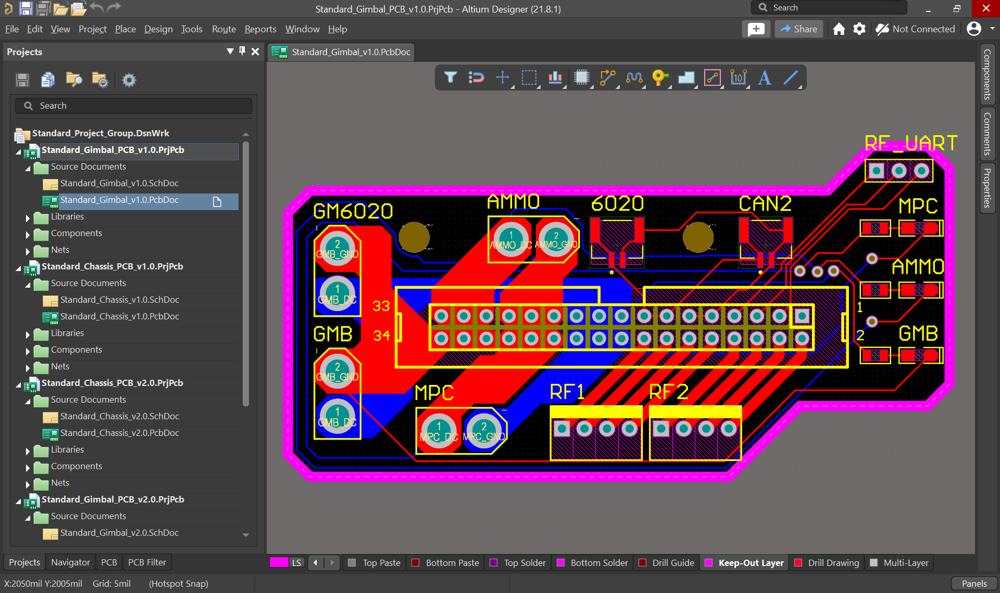
    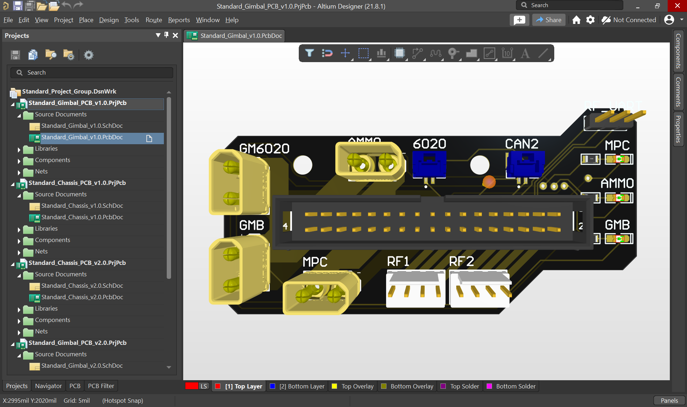

# Standard PCB v2.0

As jetson nano were applied to the new gimbal, new features include upload firmware remotely, or remote serial port were added. These functions all needs hardware's support. Originally, individual ST-Link and USB to port module were applied. But wiring were in a mess. To simplify the circuit, new PCB were created.

Previous PCB consists of 4 layers, which is time-consuming and costly for manufacturing. Instead, the new PCB adopted 2 layer design, while ensure the stability of the function. It integrates CP2102 and ST-Link into a single board, while connects the CAN BUS to control the chassis motors and the power supply for electronics on gimbal.

    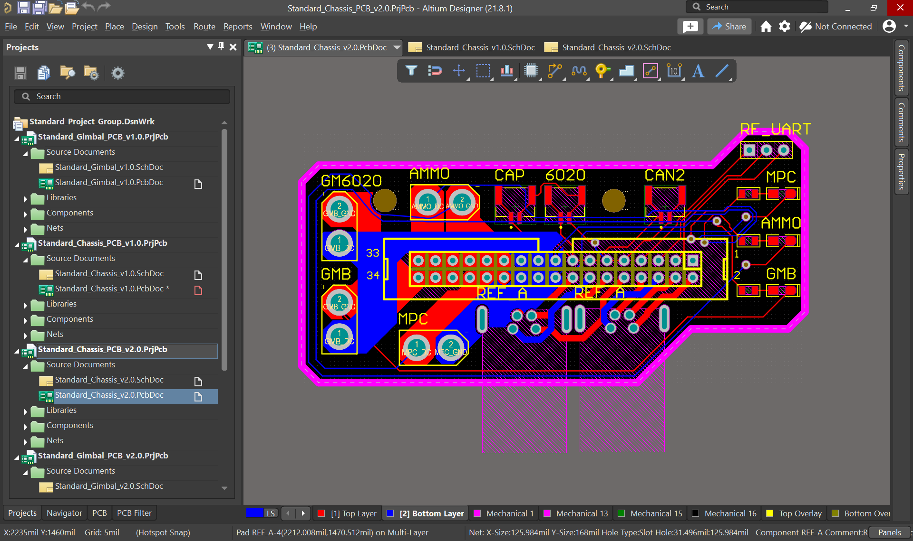
    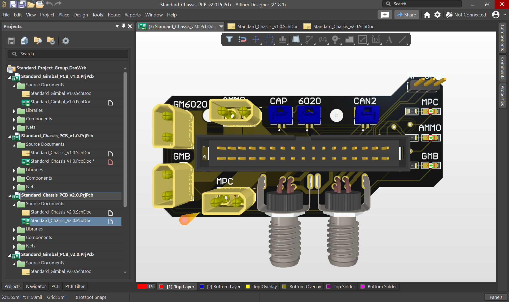
    
    
    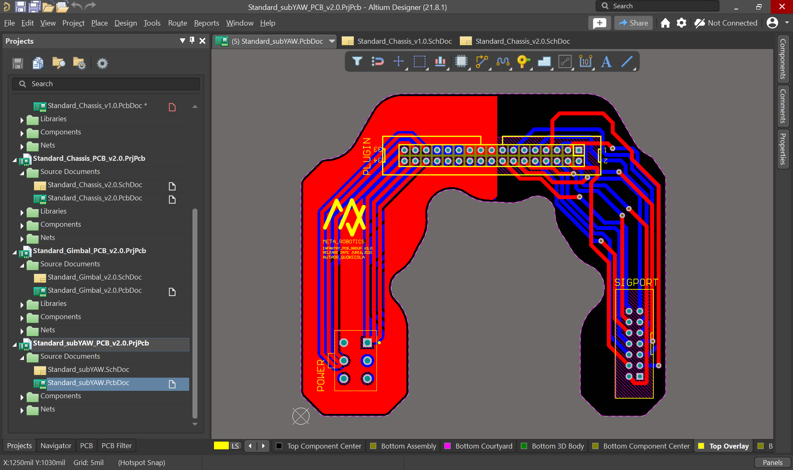
    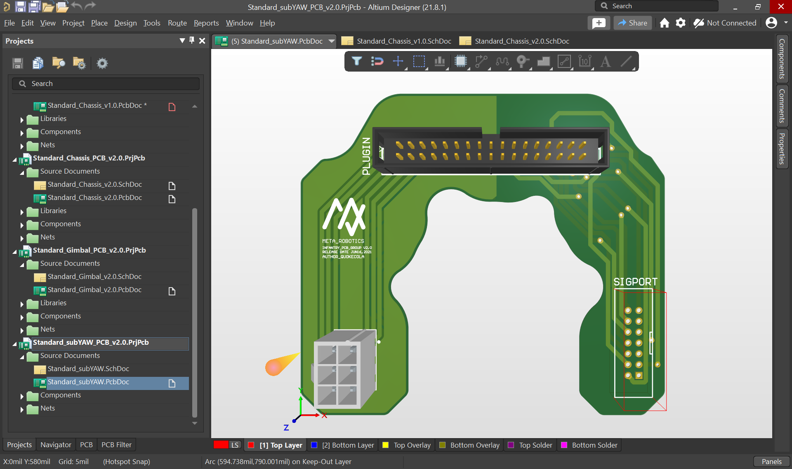

>